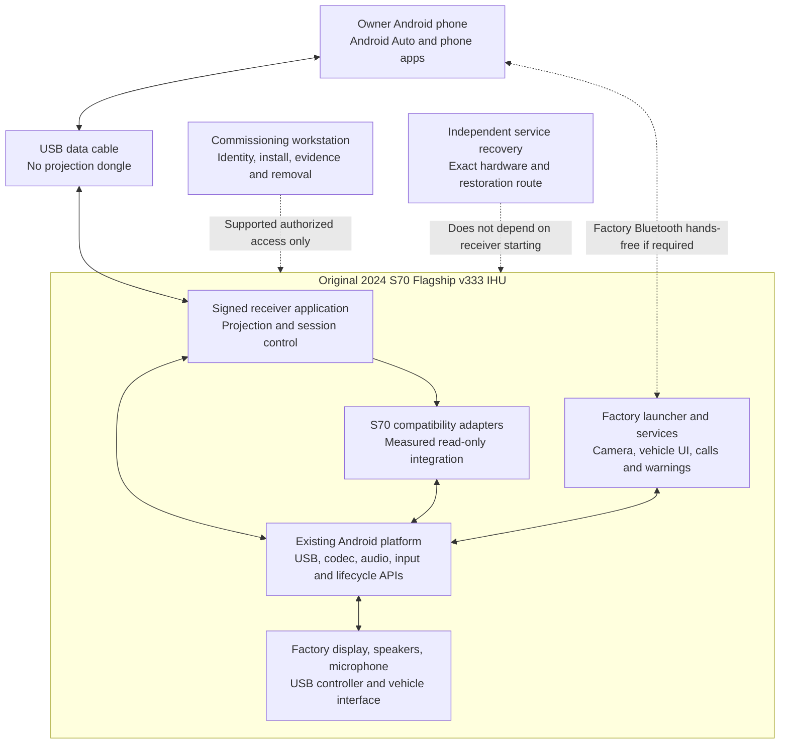
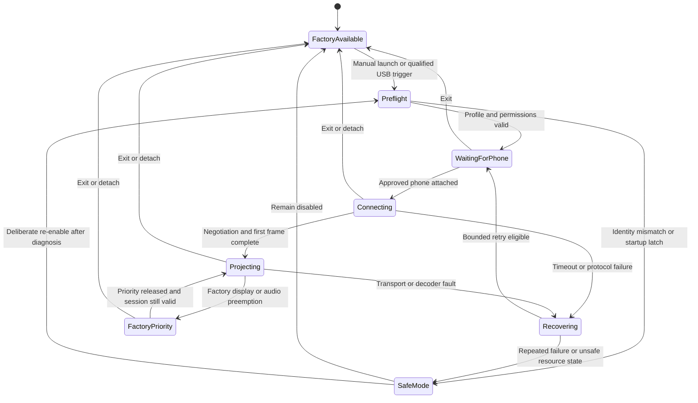
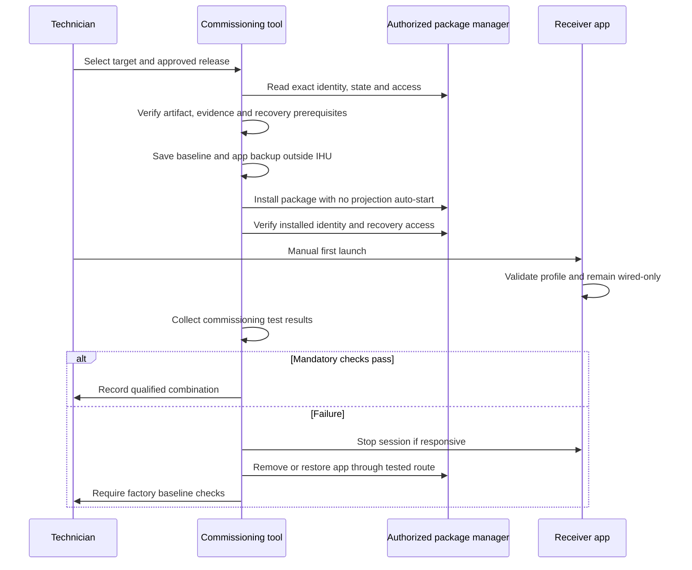

# System architecture — S70 v333 wired Android Auto

Document: S70-AA-ARCH · Version: 0.1 · Date: 2026-09-13 · Status: proposed architecture

This architecture implements the intent of the [requirements](REQUIREMENTS.md). It is conditional on ordinary application access, usable factory peripheral APIs, and independent recovery being demonstrated. No S70 integration API or installation method is asserted to exist merely because it appears as an interface below.

## 1. System context

The phone runs Android Auto and its apps. The IHU receives the projection and bridges the intended display, touch, audio, and microphone channels. The PC participates in commissioning and testing only. Factory software retains ownership of vehicle functions; the new app neither replaces the camera application nor issues vehicle-control commands.

USB direction must be verified: for the intended wired path the head unit acts as USB host and the phone participates in Android Open Accessory negotiation. A charging-only port is insufficient. Android exposes host enumeration and per-device permission APIs, but physical controller/driver support remains a hardware question. See [USB host documentation](https://developer.android.com/develop/connectivity/usb/host).

## 2. Component responsibilities

| Component | Responsibility | Boundary / failure behavior |
|---|---|---|
| Receiver core | Reuse a pinned Open Headunit implementation for projection protocol and channel handling | Application UID only; no installation privilege |
| USB transport adapter | Discover permitted phone interfaces, negotiate connection, release on detach, bound retries | One projection transport owner; never claim storage/camera devices |
| Session controller | Own state transitions, timeouts, consent, safe mode, and reconnection policy | Every entry point obeys one policy; no background reconnect loop |
| Video adapter | Negotiate a supported profile, decode H.264 initially, map display margins and touch coordinates | Release surface when hidden; never force over a factory camera |
| Audio/mic adapter | Route media/navigation/speech, handle focus, record mic on request, restore resources | Call ownership is explicit; no blanket system-volume or DSP rewrite |
| S70 integration adapter | Translate verified factory events or Android callbacks to normalized priority, key, theme, and lifecycle events | Unknown values remain unknown; no invented vendor package/broadcast mappings |
| Local health controller | Detect app/projection failures and disable repeated automatic starts | Same-OS protection only; cannot repair Android or firmware |
| Configuration store | Store validated target profile, app preferences, safe-mode latch, configuration schema | Atomic changes and previous valid configuration; bounded retention |
| Diagnostics | Structured timestamps, session states, error classes, resource metrics, sanitized export | No raw content recording or automatic upload |
| Desktop commissioning tool | Preflight, artifact checks, controlled package changes, evidence, removal and app restore | No root/flash fallback; never used in normal projection operation |
| Test runner | Execute scenarios against fake interfaces, AVD, reference device, or matching bench | Environment is recorded; simulated results cannot satisfy hardware tests |
| Service recovery | Restore a unit whose Android UI or boot is unavailable | External prerequisite with hardware-specific evidence and operator |

Modules are initially in one ordinary APK, with a possible separate `:projection` Android process only if profiling shows a useful fault boundary and upstream integration is maintainable. A second process can isolate some native crashes; it is not independent recovery and does not get extra privileges. Avoid a separate privileged watchdog APK.

## 3. Receiver selection and adaptation

Use Open Headunit as the candidate receiver, subject to the audit and bench gates in [research](RESEARCH.md). First preserve an unchanged reference build for comparison. Then produce a clearly identified S70 build with the smallest necessary changes.

The existing repository pin is `2f07eeec18d3357e865e761ec76423943dfd880e`; its source identifies version `3.3.0-beta4`. Current upstream releases are a separate evaluation track, not an automatic update. The pinned [build configuration](https://github.com/andreknieriem/open-headunit/blob/2f07eeec18d3357e865e761ec76423943dfd880e/app/build.gradle.kts) supports building an Android APK but does not establish v333 compatibility.

Proposed S70 changes:

- Centralize all boot, USB, Bluetooth, activity, and service start decisions behind the session/safe-mode policy.
- Ship wired-only defaults, manual first launch, no self-mode, no overlay window, and no OEM-app suppression features.
- Restrict permissions and exported controls to the tested wired use case. Audit navigation intent interception and generic vendor-key listeners to avoid unintentionally changing factory behavior.
- Add the target profile and explicit supported/unsupported capability reporting.
- Add fault injection only in lab builds, with production exclusion verified from the final artifact.
- Maintain separate development and release identities. Choose a distinct project-controlled application ID for the final derivative during technical design to avoid collisions with upstream/store installations; do not silently replace another app's data.

The pinned source already contains a [wireless boot-loop policy](https://github.com/andreknieriem/open-headunit/blob/2f07eeec18d3357e865e761ec76423943dfd880e/app/src/main/java/com/andrerinas/openheadunit/app/BootLoopPolicy.kt) and a [projection watchdog policy](https://github.com/andreknieriem/open-headunit/blob/2f07eeec18d3357e865e761ec76423943dfd880e/app/src/main/java/com/andrerinas/openheadunit/aap/ProjectionWatchdogPolicy.kt). Review and extend their actual behavior rather than assuming a generic watchdog already covers installation, wired startup, every boot entry, or OS recovery.

## 4. Proposed interface contracts

These contracts describe responsibilities for the future technical specification, not existing vendor APIs.

| Interface | Inputs / outputs | Rules |
|---|---|---|
| `TargetIdentity` | Hardware revision, full software/build identity, API/ABI, profile schema | Compare against tested allowlist; evidence IDs kept separately from private device identifiers |
| `CapabilityProfile` | USB roles, usable display rectangle, codec modes, audio routes, mic source, supported key paths, factory priority behavior | Every capability has value, provenance, measured date, confidence, and test IDs |
| `ProjectionTransport` | Attach/detach, consent, open/close, channel data, typed error | Explicit target phone; bounded queues; cancellation; no retries after safe mode |
| `FactoryPrioritySource` | Foreground/audio ownership and priority events with timestamps and validity | Use observed lifecycle/audio behavior or verified read-only OEM interface; no assumption that one callback covers all cameras/alerts |
| `VehicleInputSource` | Normalized media/voice key with origin, press type, timestamp | Deduplicate events from overlapping paths; vehicle-control keys never forwarded |
| `PowerLifecycleSource` | Resume/suspend/boot observations, validity, source | Missing or stale state disables auto-resume; no driving-state fabrication |
| `RecoveryController` | Disable automatic projection, stop session, clear app configuration, export status | Limited to own app; external host performs package removal only through authorized access |
| `InstallManifest` | App identity, version/signing fingerprint, digest, target profile digest, evidence bundle IDs, compatible config schema | Immutable release manifest approved with test evidence; reject incompatible versions |
| `EvidenceRecord` | Requirement, test, environment, target/artifact/phone versions, metrics, verdict, artifact links | PASS/FAIL/BLOCKED/NOT RUN/SIMULATED are explicit |

Production capability values come from real observation. Fake camera events and a synthetic resolution belong only to lab fixtures. Do not label an AVD profile “v333 certified.”

Driving-state data is supplied only if a verified, permitted source exists. Do not substitute a constant parked state when data is missing. Preserve the phone's restrictions and keep receiver configuration within the controlled commissioning workflow; the product specification must define conservative behavior for unknown state.

## 5. Audio, calls, and factory priority

| Function | Proposed path | Required investigation |
|---|---|---|
| Media | Phone projection audio → receiver output → factory audio system | Correct speakers, volume behavior, audio-focus coexistence |
| Navigation/speech | Separate projection channel → appropriate validated output usage | Ducking/mixing without masking warnings; no persistent focus lock |
| Assistant mic | Factory mic → permitted Android capture → phone projection channel | Whether ordinary app can access mic; gain, echo, factory voice conflict |
| Calls | Prefer preserving phone ↔ factory Bluetooth hands-free where that is the working stock path | Actual HFP/SCO ownership, caller UI, steering controls, AA and native dialer behavior |
| Factory alerts | Original vendor path | Observe independently of Android audio focus; never reroute through receiver |
| Camera | Original vendor foreground/overlay path | Verify camera can preempt during decode, loading, failure, and reconnect |

For the expected API 28 platform, audio-focus compliance by the receiver is essential; the enforcement added in later Android versions cannot be assumed. The app must stop/duck according to measured priority and release capture promptly. See [Android audio focus](https://developer.android.com/media/optimize/audio-focus).

Wired projection does not imply calls must use USB audio. Preserve a successful stock hands-free path rather than selecting a second competing audio owner. Bluetooth may remain enabled for calls even though wireless projection is disabled. If the factory mic is inaccessible to ordinary apps and no supported integration exists, voice requirements fail; do not hide that behind phone-mic fallback.

Use activity/window lifecycle and audio callbacks as initial mechanisms. They are not guaranteed complete detectors of vendor camera overlays. A missing camera event may be acceptable only if measured factory preemption inherently works and the receiver cannot regain priority; otherwise integration is blocked. Any watchdog that requests video focus must be suppressed while the factory has priority.

## 6. Runtime state model

All states respond to suspend, cancellation, and removal of required permissions by closing app resources and avoiding automatic foreground takeover. Factory priority is never delayed while the app waits for a healthy-session decision.

Proposed guard policy: persist a start-attempt marker before initializing projection; clear it only after a defined healthy session and clean teardown policy. After three unsuccessful starts in a bounded ten-minute window, latch automatic startup off. Use boot identity and monotonic duration accounting to handle clock changes; exact persistence design belongs in the technical specification. Default automatic startup is off, so the marker is an additional mitigation rather than the only protection.

Health must combine protocol liveness, lifecycle, outstanding work, decoder progress when frames are expected, and audio resource state. A static Android Auto screen can legitimately produce no new frames; do not treat a frame gap alone as a crash.

## 7. Installation and update architecture

The host journal records preflight, package operation started, package operation confirmed, manual launch, validation, and rollback result. Interruption means the host must inspect actual package state on reconnect; do not assume the last request failed or succeeded. A timeout must not trigger an unconditional reinstall.

For upgrades, keep the previous compatible app artifact and versioned configuration outside the IHU. Android may refuse downgrades or signature mismatches; support a tested uninstall/reinstall or forward-version recovery build strategy, with explicit app-data loss/migration handling. Do not presume OS package rollback APIs are usable by an ordinary app on API 28.

The USB port used for phone projection might not simultaneously expose a PC debugging link. Before testing, prove an independent management port/transport or a reliable stop-and-switch procedure with retained authorization. A hub does not automatically solve conflicting USB roles.

## 8. Build, release, and evidence flow

```mermaid
flowchart LR
    Source[Pinned source and S70 changes] --> Build[Repeatable build and dependency audit]
    Build --> Lab[Host and emulator tests]
    Lab --> Ref[Real phone and reference Android device]
    Ref --> Bench[Matching v333 bench qualification]
    Bench --> Manifest[Fixed signed artifact and evidence manifest]
    Manifest --> Car[Controlled parked-vehicle commissioning]
    Car --> Qualified[Supported hardware and phone matrix]
    Qualified --> Recheck[Revalidate after relevant updates]
    Recheck --> Lab
```

Development artifacts may be debug signed; vehicle candidates must use the controlled release identity and the exact artifact tested on the bench. Pin build dependencies and tools, retain checksums, preserve corresponding source/notices, and verify packaged permissions/components. “Repeatable build” initially means controlled inputs and documented outputs; bit-for-bit reproducibility is a separate measurement, not assumed.

Evidence, raw private profiles, service backups, and public documentation have separate storage rules. Private recovery material stays outside the public repository. The repository contains synthetic fixtures, original code, sanitized reports, and references to privately held evidence.

## 9. Architectural decisions and limits

| Decision | Reason | Revisit condition |
|---|---|---|
| Ordinary APK alongside stock | Limits mutation scope and keeps factory UI available | Mandatory capability cannot be achieved; trigger feasibility review |
| Wired first | Matches owner scope and reduces wireless handshake/radio dependencies | Owner requests wireless after wired release |
| Reuse receiver core | Avoid implementing an entire projection stack initially | Audit, protocol compatibility, or maintainability fails |
| No assumed AAOS VHAL | Existing S70 platform is not established as AAOS | Measured platform proves supported APIs exist |
| Independent recovery prerequisite | Same-OS watchdog cannot recover a dead OS | Never waived by emulator success |
| Matching bench before owner's car | Satisfies hardware prevalidation requirement | Only an explicit requirements change can lower this evidence standard |
| No overlaid emergency button | Overlay permission could interfere with factory screens | Only if separately proven necessary and safe; factory Home remains independent |
| Native factory controls remain native | Preserves trusted vehicle UI and reduces unknown integration | Separate future feature specification with supported interfaces |

This is an engineering architecture, not a functional-safety certification. A no-dongle software solution remains a hypothesis for this exact v333 unit until access, integration, and recovery gates are passed.
