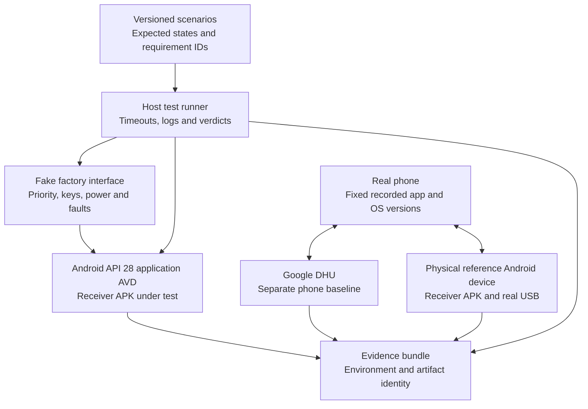

# Test environment and validation plan

Document: S70-AA-VAL · Version: 0.1 · Date: 2026-09-13 · Status: design, not executed

## 1. What testing can establish

Use multiple environments because no single tool covers protocol behavior, Android APK behavior, proprietary S70 peripherals, and recovery. The owner's requested pre-install validation needs a matching physical v333 environment before installing in the owner's vehicle. Even that environment must be followed by a final parked-vehicle acceptance check.

| Level | Environment | Can establish | Cannot establish |
|---|---|---|---|
| L0 | Host tests / synthetic event harness | State transitions, profile validation, timeout/retry policy, config handling, installer decisions | Real projection, Android drivers, S70 compatibility |
| L1A | Google DHU + real owner phone | Phone Android Auto baseline, available apps, behavior under simulated focus/input | Runs a different receiver; does not execute the proposed APK or v333 firmware |
| L1B | Android application AVD at API 28 initially | APK installation/UI/lifecycle, denied permissions, synthetic audio/priority/key events | Exact S70 USB/Bluetooth/MCU/audio/camera/boot behavior |
| L2 | Real Android reference device + phone + data cable | Actual receiver USB/protocol/codec/mic behavior on reference hardware | Proprietary S70 routes, factory controls, v333 installation/recovery |
| L3 | Matching S70 hardware/firmware bench + representative peripherals | Real v333 package install/removal, hardware routes, power behavior, recovery rehearsal | Vehicle-only calibration, acoustic conditions, missing harness/ECU behavior |
| L4 | Owner's vehicle, safely parked, controlled commissioning | Actual installed vehicle coexistence and final acceptance | General driving safety certification or reliability across untested combinations |

Google describes DHU as a desktop head-unit emulator for testing phone apps and provides USB/ADB connection modes. It is not a v333 virtual machine or a container into which the receiver APK can be installed. See [DHU documentation](https://developer.android.com/training/cars/testing/dhu).

Android's documented emulator limitations include USB and Bluetooth virtual hardware limitations. Regardless of evolving emulator features, matching the API level and screen geometry does not recreate the S70's vendor drivers or firmware. See [Android Emulator limitations](https://developer.android.com/studio/run/advanced-emulator-usage). An AAOS emulator/VHAL may illustrate a vehicle event model, but no S70 AAOS/VHAL equivalence has been established; [AOSP VHAL](https://source.android.com/docs/automotive/vhal) is not an automatic substitute.

## 2. Software laboratory architecture

AVD scenarios use synthetic inputs and public Android behavior. Optional developer-server networking may exercise a real phone stream against the APK if separately proven workable, but such a path is labeled lab-only and does not satisfy wired-USB acceptance. Do not connect DHU to the receiver as if DHU were an Android Auto phone.

The initial AVD uses API 28 as a hypothesis. Record the image ID, ABI, emulator version, display dimensions, density, RAM allocation, and snapshot baseline. Use clearly labeled synthetic display profiles until measured v333 data is available. ARM-target native libraries need real ARM testing; an x86 emulator pass cannot validate ARM binary behavior.

The simulated S70 interface supplies timestamped events for camera/factory priority, audio ownership, keys, theme, wake/sleep, USB denial/detach, and unavailable/stale data. It models our contract, not an undiscovered OEM API. Tests must include missing, duplicated, reordered, and stale events. Test-only injection interfaces must be absent or inaccessible in release artifacts.

## 3. Workstation and tools

Recommended starting setup: the existing Windows workstation with Android Studio/SDK, JDK 17 and the pinned NDK/CMake toolchain, Platform Tools, Git, Python, a real Android phone, and a suitable USB data cable. A machine with hardware virtualization, roughly 16 GB RAM or more, and sufficient SSD space for SDK/emulator images is a planning recommendation, not a purchase requirement or validated hardware minimum.

Use native Windows Android tools for phone/USB work where practical. The repository's current helpers are Bash scripts; future tooling must either document a working Bash environment or provide equivalent Windows support. A Linux VM/WSL build environment does not automatically solve USB passthrough. Keep build/runtime paths and tool versions in the lab manifest.

| Tool | Intended use | Availability / limitation |
|---|---|---|
| Android Studio, SDK/NDK, Gradle | Build and run receiver APK | Standard development tooling; pinned versions needed |
| AVD + host unit tests | UI/lifecycle and integration-contract simulation | Can be prepared before IHU access |
| Google DHU | Real-phone comparison receiver | Does not test our APK or vehicle |
| ADB / logcat / selected dumpsys | Authorized install, diagnostics, app stop/removal | Requires enabled/authorized device; some production dumps may be denied |
| UI Automator | Android UI journeys and system permission dialogs | Framework version must support target API; avoid automating unrelated vehicle actions |
| apksigner / APK inspection | Verify signing identity, package, permissions and native ABIs | Does not certify suitability for S70 |
| Python test/report tools | Scenario orchestration, preflight negatives, evidence/traceability | New harness and stricter checks still need implementation |
| App metrics, supported tracing tools | Frame/input timing, memory, lifecycle and audio-resource evidence | Current Android Studio/Perfetto features vary by API and permissions; establish supported API 28 capture path first |
| jadx / Apktool | Offline inspection of legitimately available manifests/code/resources | Optional research tools; no installation access or full emulator produced |
| Wireshark / supported USB capture | Own-device lab transport diagnostics | Optional; encrypted payloads and vendor hardware limit visibility |

Primary tool links and selection rationale are in [research](RESEARCH.md). No paid tool is required to write the specifications or begin the PC lab. Physical v333 validation, a reference device, and service recovery can create costs; obtain quotes after hardware identification, not speculative shopping lists.

## 4. Physical bench specification

The bench should provide a verified matching IHU, relevant MCU/peripheral versions, its display/touch path, the actual USB host path, correct fused harness, and a stable current-limited power arrangement set from verified service information. Include representative audio output/load and factory microphone; add camera and validated interface equipment if those functions are claimed as bench-tested.

Use a competent automotive electronics technician for harness/power/recovery setup. A bare head unit may not boot or expose normal features without vehicle authentication, pairing, or required network participants. Verify these dependencies before buying hardware. A simulator that merely feeds our app a “reverse” event cannot prove the real factory camera path.

For power tests distinguish Android reboot, deep sleep, accessory-power wake, and actual supply interruption. Record voltage/current/time and measured device state. Do not perform arbitrary live-vehicle network injection. Simulated events belong in the application harness or an isolated, qualified bench fixture.

Acceptable acquisition options: borrow a verified unit, rent bench access, or contract a lab/qualified installer to execute this plan with the fixed candidate APK and export evidence. Require hardware identity, actual test coverage, recovery rehearsal, artifact digests, and results. A video of Android Auto running on an unidentified S70 is insufficient.

## 5. Test catalog and requirement traceability

Detailed executable cases will be written in the technical specification. The following defines the minimum suite. Numeric acceptance references refer to [requirements section 4](REQUIREMENTS.md#4-proposed-quantitative-acceptance-targets).

| Test | Scenario | Environment | Requirements / acceptance |
|---|---|---|---|
| T01 | Identity complete, missing fields, wrong hardware, misleading v333 string, wrong device selected | L0, L3 | ID-01, ID-02, ID-05; reject unknown/mismatch before write |
| T02 | Authorized access, unavailable access, reboot persistence, projection/debug USB switching | L3 | ID-03, ID-04, RC-09; removal and independent recovery reachable |
| T03 | Wrong digest/signature/package/API/ABI, insufficient storage, changed profile, interrupted install | L0, L1B, L3 | RC-01 to RC-04, RC-08, NF-07; no auto-launch, reconcile actual state |
| T04 | Owner phone/apps/region/language with DHU | L1A | AA-03, AA-10, QA-02; establish phone baseline only |
| T05 | Real wired first connect, approved permission, deny/retry, no developer server | L2, L3, L4 | AA-01, AA-09, NF-01; qualified phone and data port |
| T06 | Video negotiation, borders, touch corners/grid, aspect ratio, repeated window changes | L1B, L2, L3 | AA-02, NF-02; measured screen profile |
| T07 | Music + navigation speech, phone offline/online, service unavailable | L2, L3, L4 | AA-03, AA-12, NF-05; usable error/state handling |
| T08 | Factory mic voice request, permission denial, native assistant conflict and restoration | L2, L3, L4 | AA-04, VH-03, NF-08; actual factory microphone |
| T09 | Ten ordinary inbound/outbound test calls during projection, media and camera takeover | L3, L4 | AA-05, VH-03, NF-08; no emergency-number tests |
| T10 | Media, voice, volume, call keys; short/long press and duplicate events | L0, L3, L4 | AA-06, VH-07, NF-08; unrelated controls unchanged |
| T11 | Camera activation during idle/connect/active/disconnect/recovery and rapid repeats | L0/L1B simulation, L3 physical, L4 | VH-01, VH-05, NF-03; simulations cannot qualify physical camera |
| T12 | Factory warning/parking audio and overlays alongside AA playback | L3, L4 through supported procedures | VH-02, VH-05, NF-04; no suppressed or masked alerts |
| T13 | Native Home, radio, climate/vehicle settings, voice, native navigation/QDLink and connectivity | L3, L4 where fitted | AA-08, VH-03; before/after inventory comparison |
| T14 | Cold boot, sleep/wake, no phone, phone already connected, display off, USB detach | L3, L4 | AA-07, AA-11, VH-04, NF-06; factory-first startup |
| T15 | Receiver crash/freeze, mic fault, corrupt config, failed migration and repeated starts | L0, L1B, L3 | RC-05 to RC-08, NF-04, NF-07; safe mode and R3 restore |
| T16 | Independent OS/service recovery and complete factory checks afterward | L3, qualified operator | ID-04, RC-03, RC-09; documented R4 restoration evidence |
| T17 | Day/night, bright/dim display, missing illumination event | L1B, L3, L4 | VH-06; conservative usable fallback |
| T18 | Two-hour per-phone sessions, primary eight-hour endurance, power/thermal/resource measurements | L3 | NF-05, NF-09; budgets and no factory regressions |
| T19 | Factory build change and phone/AA update; old profile/config | L0, L3; phone at L1A/L2 | RC-10, AA-10, QA-07; requalification policy |
| T20 | Export logs, secret/identifier fixtures, disk cap, exported controls, release permissions | L0, L1B, static artifact review | SE-01, SE-02, SE-04, NF-09; no lab-only control path in release |
| T21 | Fixed source/build, native-library/license inventory, package signing and release evidence | Build and review | RC-02, SE-03, DL-02; fixed qualified artifact |
| T22 | Evidence labeling and complete requirement mapping, blocked/missing prerequisites | L0 and document review | QA-01 to QA-07, DL-01, DL-02; no false green status |
| T23 | Driving restrictions, unavailable/stale vehicle state, and setup/diagnostic access | L0, L1B, L3 with qualified simulation | AA-13; no fabricated parked state or restriction bypass |

Calls and voice checks use consenting test participants and non-sensitive commands. Vehicle checks are performed parked. Some dynamic warning functions cannot be triggered meaningfully while parked; use a supported service test or matching qualified fixture. If a mandatory alert path lacks a suitable verification route, mark it BLOCKED rather than claim all warnings were tested.

## 6. Measurement and evidence rules

For each run retain: test and requirement IDs, lab level, date, full supported hardware/software identity, app digest and signing fingerprint, phone/OS/Android Auto/app versions, configuration hash, equipment and calibration information where relevant, stimulus, expected/actual behavior, numerical samples, verdict, and reviewer.

For camera priority, measure from the same physical/verified factory trigger to a usable camera image with and without the receiver, using synchronized logs or external video with stated timing resolution. App callbacks alone cannot measure when a camera truly appears. Record p95 and worst case; any occlusion or failed event fails the test even if timing averages pass.

For touch latency, correlate visible input/stimulus and response using an agreed repeatable method. For audio, combine app event timing with an external recording or instrumented test signal where appropriate; listening alone cannot substantiate a 250 ms limit. Do not retain private speech/call recordings by default.

For off-state power, use the same supply/vehicle conditions and stabilization time for stock and candidate, recording wake activity. Agree actual acceptable current and temperature ranges from device limits and measured stock behavior before qualification; arbitrary universal numbers are not valid for an unknown IHU.

Verdicts: PASS, FAIL, BLOCKED, NOT RUN. Add an explicit SIMULATED evidence flag for fake interfaces; keep that separate from hardware qualification. Mark partial peripheral coverage, denied diagnostic commands, and unsupported instrumentation explicitly.

## 7. Execution order for this owner

1. Review requirements and proposed targets; record phone information and full IHU identity through normal owner/service channels.
2. Prepare L0/L1 lab and compare the real phone with DHU. Build the candidate receiver on controlled inputs.
3. Use an available physical Android reference device for wired receiver validation.
4. Resolve supported v333 access, matching bench availability, and independent recovery. This is the critical path and may proceed alongside software work.
5. Execute L3 tests/recovery using the fixed candidate artifact. Complete the product and technical specifications with the measured interfaces and operating limits.
6. Only after the bench gates pass, perform controlled owner-vehicle commissioning and L4 checks. Any factory regression requires stopping the trial and restoring the baseline.

No vehicle installation or laboratory setup has been performed as part of this specification task. The package defines what must be built and demonstrated next.
